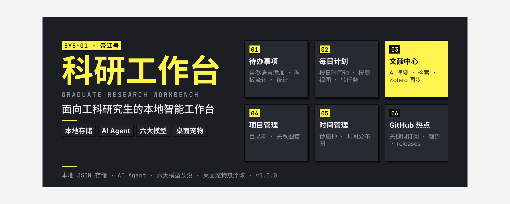

# 科研工作台 · Graduate Research Workbench

> 面向工科研究生的个人智能工作台 · 桌面应用 · **所有数据保存在本地** · AI Agent 集成

一个开箱即用的本地科研工作台：每日计划、进度看板、文献总结、项目管理（目录树 + 关系图谱）、日报/周报、GitHub 热点追踪，以及贯穿全功能的 AI 助手。

---

## 📦 下载（Release）

**直接下载打包好的应用**：到 [GitHub Releases](https://github.com/rison114514/grad-research-workbench/releases/latest) 下载对应平台的安装包，**解压即用，无需安装 Node / 无需配置环境**。

| 平台 | 下载 | 说明 |
|---|---|---|
| 🍎 macOS（Apple Silicon） | `workbench-v1.5.2-mac-arm64.zip` | 解压后直接运行 `科研工作台.app`（⚠️ 见下方 macOS 说明） |
| 🪟 Windows x64 | `workbench-v1.5.2-win32-x64.zip` | 解压后运行 `科研工作台.exe`（**建议用 7-Zip 解压**，见下方 Windows 说明） |
| 🛡️ 完整性校验 | `SHA256SUMS.txt` | 与 zip 同目录，用于核对下载文件的哈希 |

> ⚠️ **macOS**：当前为 ad-hoc 签名（无 Apple 官方公证）。首次打开若提示「无法验证开发者 / 应用已损坏」，请 **右键 → 打开** → 再点「打开」；仍被阻止可在「系统设置 → 隐私与安全性」中选择「仍要打开」。
> ⚠️ **Windows**：
> - 尚未做 Authenticode 商业签名，SmartScreen 可能提示「未知发布者」→ 点「更多信息」→「仍要运行」即可。
> - **务必完整解压 ZIP 后再运行 `科研工作台.exe`**，不要直接在压缩包内双击。若 Windows 自带解压（资源管理器）报「无法解压缩 / 文件损坏 / 不支持此压缩格式」，请下载免费开源的 **[7-Zip](https://www.7-zip.org/)**（官网 64-bit x64 版），右键 zip → `7-Zip` → `解压到当前文件夹` 后运行。
> 💡 新版发布会在 [Releases 页](https://github.com/rison114514/grad-research-workbench/releases) 推送，建议 Star 仓库跟进更新。

---

## 快速开始

```bash
cd app
npm install        # 安装依赖（含 Electron）
npm start          # 启动应用（开发模式）
```

### 打包为可分发应用（自动签名）

```bash
cd app
npm run pack        # 一步完成：electron-packager 组装 → ad-hoc 整包重签 → 严格验证 → 压缩 ZIP → 解压复验
```

- 产物：`dist/科研工作台-v1.5.2-mac-arm64.app`（arm64 / Apple Silicon）+ `.zip`（约 113MB）
- **Windows**：`npm run pack:win` → `dist/科研工作台-v1.5.2-win32-x64.zip`（约 125MB，内含主程序 `科研工作台.exe`；mac 上交叉打包走手动构造流程，含关键文件完整性校验 + 解压复验）
- **Release 上传**：GitHub 资产名仅支持 ASCII，发布时使用 `workbench-v1.5.2-mac-arm64.zip` / `workbench-v1.5.2-win32-x64.zip`（内容与本地中文名 zip 完全一致）
- 已内置自定义应用图标（`build/icon.icns` / `build/icon.ico`，源自品牌 logo）
- **签名**：`scripts/package.sh` 会对最终 .app 执行 `codesign --force --deep --sign - --timestamp=none`，并 `codesign --verify --deep --strict` 确认 `valid on disk` / `satisfies its Designated Requirement`，压缩后解压再复验一次。避免出现「应用已损坏 / 无法验证开发者」的签名结构错误。
- **注意**：ad-hoc 签名只适合本机/信任用户验证，无 Apple 官方信任，首次打开仍可能提示「未验证的开发者」（右键 → 打开）。公开发布需 Apple Developer ID 证书 + Hardened Runtime + Notarization 公证后再做 ZIP/DMG。

首次启动后，建议到「设置」页配置 AI 服务（支持 DeepSeek / OpenAI / 通义千问 / 智谱 / Kimi / Ollama 本地，或自定义 OpenAI 兼容端点）。**不配置 AI 也能使用全部功能** —— 文献摘要、任务拆解、报告生成会自动降级为本地模板。

## 功能模块

| 模块 | 说明 |
|---|---|
| 📅 待办事项 | 任务创建 / 优先级 / 截止日期 / 完成状态；支持**自然语言添加任务**（如「明天下午3点 完成实验设计（高优先级）」自动解析时间与优先级） |
| 📊 进度看板 | Kanban 三列拖拽流转 + ECharts 统计（完成率环形图、优先级分布、近 7 天趋势） |
| ⏱️ 时间规划 | **标准番茄钟**（时长/休息可配置、分类、SVG 圆环进度、完成后自动归档）+ **每日/每周时间分布图**（番茄钟自动计入「专注」+ 手动时间块） |
| 📆 每日计划 | **按日时间轴**（早到晚时间段 + 类型 + 备注 + 勾选）+ **按周视图**（周一~周日卡片）；计划项可**一键转为今日计划任务**（双向关联） |
| 🏃 运动健身 | 健身计划（类型/周目标/单次时长）+ **每日打卡**（关联计划/时长/完成状态）+ 统计（本周次数、计划完成率、连续打卡天数、近 7 天记录） |
| 📚 文献中心 | 输入文献信息 → **AI 生成结构化摘要笔记** → 归档 / 检索 / 标签 |
| 🗂️ 项目管理 | 选择本地项目文件夹 → 扫描目录树 → **ECharts 力导向关系图谱** + 文件预览 |
| 📝 日报/周报 | 按日期聚合任务完成 / 文献 / 项目动态 → 生成 Markdown → AI 润色 → 导出 `.md` |
| ⭐ GitHub 热点 | 订阅领域关键词与仓库 → 热门趋势（star 排序）+ releases 更新动态聚合 |
| 🤖 AI 助手 | 全局对话抽屉，自动携带当前工作区上下文（任务列表 / 文献 / 报告） |

## 系统架构

```
┌─────────────────────────────────────────────────────────┐
│                  Electron 桌面应用                        │
├───────────────┬─────────────────────────────────────────┤
│  渲染进程       │  主进程（Node.js）                       │
│  (原生 SPA)    │                                         │
│  index.html    │  main/index.js        窗口与生命周期      │
│  ├ app.js      │  main/ipc.js          IPC 通道注册       │
│  ├ tasks.js    │  main/store.js        ★ 本地数据存储层    │
│  ├ board.js    │  main/fs-service.js   项目扫描/关系图谱    │
│  ├ literature  │  main/github-service.js  GitHub API      │
│  ├ projects.js │  main/ai-service.js   ★ AI 服务层        │
│  ├ reports.js  │  main/report-service.js 日报/周报聚合     │
│  ├ github.js   │  preload.js           contextBridge 安全桥│
│  ├ settings.js │                                         │
│  └ assistant.js│                                         │
│  vendor/echarts│                                         │
└──────┬─────────┴──────────────────────┬──────────────────┘
       │ contextBridge (白名单 API)      │ IPC (ipcRenderer.invoke)
┌──────┴─────────────────────────────────┴──────────────────┐
│                    本地数据（userData/data/）              │
│   tasks.json · projects.json · literature.json            │
│   reports.json · githubSubs.json · activity.json · settings.json │
│   原子写入（临时文件 + rename），可一键备份                 │
└────────────────────────────────────────────────────────────┘
        │                          │
   ┌────▼────┐            ┌────────▼────────┐
   │ 本地文件系统 │            │ OpenAI 兼容 API  │
   │ 项目文件夹  │            │ DeepSeek / 通义 /  │
   │ 扫描与预览  │            │ 智谱 / Kimi / Ollama│
   └──────────┘            └─────────────────┘
```

### 三层架构说明

1. **渲染进程**：原生 HTML/CSS/JS 单页应用，零构建依赖；ECharts 本地化（vendor），完全离线可用。通过 `window.api`（contextBridge 暴露的白名单 API）与主进程通信，无 Node 直接权限，安全隔离。
2. **主进程**：所有敏感操作（文件系统、网络请求、数据持久化）集中于此：
   - `store.js`：JSON 原子写入存储层，按数据域分文件；提供 CRUD、设置、统计聚合
   - `fs-service.js`：项目文件夹递归扫描（忽略 node_modules/.git 等噪音），生成目录树与关系图谱数据
   - `ai-service.js`：OpenAI 兼容 `/v1/chat/completions` 调用 + 模型预设 + 本地降级模板
   - `github-service.js`：GitHub Search / Releases API，支持 PAT，限流降级提示
3. **本地数据**：全部位于 Electron `userData/data/` 目录，JSON 文件 + 原子写入防损坏；设置页提供「打开目录」「立即备份」。

## 设计系统（v4 · 终末地风格全面重做）

参考《明日方舟：终末地》视觉语言全面重做，主色调整为柠檬黄 `#FFF44F`，大幅强化黄色线条与多层立体阴影，并整合 ardot 生成的「终末地风格」背景纹理素材：

| 维度 | 设计决策 |
|---|---|
| **主色** | `#FFF44F` 柠檬黄（替代 v3 的 `#E8FF00`，更暖更亮） |
| **黄色线条装饰** | 侧边栏右边缘 4px 黄竖线、品牌区/底部黄装饰线、卡片左 4px 黄条、统计卡/图表卡/设置卡顶部 4px 黄条、导航激活态黄底、标签黄边、Markdown 标题黄左边、hr 黄虚线、滚动条黄黑 |
| **多层立体阴影** | 主按钮双色硬阴影（`4px 4px 0 #000` + `8px 8px 0 #FFF44F`，hover 缩进）、卡片柔和三层阴影（`0 1px 3px` + `0 4px 12px` + `0 12px 32px`）、弹窗双层硬阴影（`8px 8px 0 黄` + `16px 16px 0 黑`）、看板卡 hover 硬阴影偏移 |
| **背景纹理** | ardot AI 生成「终末地风格」纹理图（`renderer/assets/endfield-texture.png`，等高线+几何）与 CSS 等高线 SVG 叠加，`background-blend-mode: multiply` 混合 |
| **框架** | 纯黑 `#000` 1.5px 硬边、零圆角、工业灰阶 `#333/#666/#999/#E5E5E5/#F4F4F4` |
| **优先级标签** | 黑底黄字（高）/ 黄底黑字（中）/ 灰底深灰（低） |
| **顶部彩条** | 黄→黑→紫→蓝→绿 4px 渐变 |
| **字体** | Inter / PingFang SC；数字 JetBrains Mono；标题 900 weight + uppercase + -0.02em |
| **交互反馈** | 按钮 hover 投影缩小+位移、卡片 hover 黄底+阴影加深、输入框 focus 黄色光晕（`0 0 0 3px var(--primary)`） |

所有 class 名保持不变，JS 零改动；素材通过 CSS `background-image` 引用，CSP `default-src 'self'` 允许本地加载。

### AI 模型预设模板

| 服务商 | Base URL | 默认模型 |
|---|---|---|
| DeepSeek | `https://api.deepseek.com/v1` | `deepseek-chat` |
| OpenAI | `https://api.openai.com/v1` | `gpt-4o-mini` |
| 通义千问 | `https://dashscope.aliyuncs.com/compatible-mode/v1` | `qwen-plus` |
| 智谱 GLM | `https://open.bigmodel.cn/api/paas/v4` | `glm-4-flash` |
| Kimi | `https://api.moonshot.cn/v1` | `moonshot-v1-8k` |
| Ollama 本地 | `http://localhost:11434/v1` | `qwen2.5:7b`（可自定义） |

## 数据模型

- `tasks`：id, title, projectId, priority(高/中/低), dueDate, status(todo/doing/done), completedAt, tags, aiSplit(子任务)
- `projects`：id, name, path, description, createdAt（path 为本地文件夹绝对路径）
- `literature`：id, title, authors, venue, year, doi, abstract, summary(摘要笔记), tags, createdAt
- `reports`：id, type(daily/weekly), dateRange, content(markdown), source(ai/local), createdAt
- `githubSubs`：id, type(keyword/repo), keyword, createdAt
- `activity`：id, date, taskId, action, content（日报/周报聚合素材）
- `timeLogs`：id, date, category(focus/work/study/life/rest/sport/reading/writing), minutes, source(pomodoro/manual), startTime?, endTime?, note
- `dailyPlans`：id, date, items[{ id, startTime, endTime, title, type(work/study/meeting/life/rest), note, done, taskId }]
- `fitnessPlans`：id, name, type(running/strength/yoga/ball/other), weeklyGoal, durationGoal, note
- `fitnessLogs`：id, date, planId?, type, durationMin, done, note
- `settings`：aiProvider, aiBaseUrl, aiModel, aiApiKey, githubToken, pomodoroFocusMin, pomodoroBreakMin

## 技术选型

- **Electron 31**：跨平台桌面应用（本机已验证 macOS）
- **原生 SPA + ECharts 5**：零构建、离线可用、轻量
- **JSON 原子存储**：个人数据量级足够，避免原生模块编译风险；存储层抽象，可平滑切换 SQLite
- **Node 内置 fetch/https**：AI 与 GitHub 请求均从主进程发出，无跨域问题

## 目录结构

```
app/
├── package.json          # 应用配置（npm start 启动）
├── main/                 # 主进程
│   ├── index.js          # 入口 / 窗口
│   ├── ipc.js            # IPC 通道
│   ├── store.js          # 数据存储层
│   ├── fs-service.js     # 文件系统 / 图谱
│   ├── github-service.js # GitHub API
│   ├── ai-service.js     # AI 服务 + 模型预设
│   └── report-service.js # 日报/周报
├── preload.js            # contextBridge 安全桥
└── renderer/             # 渲染进程
    ├── index.html
    ├── css/theme.css
    ├── js/*.js           # 各功能模块
    └── vendor/echarts.min.js
```
